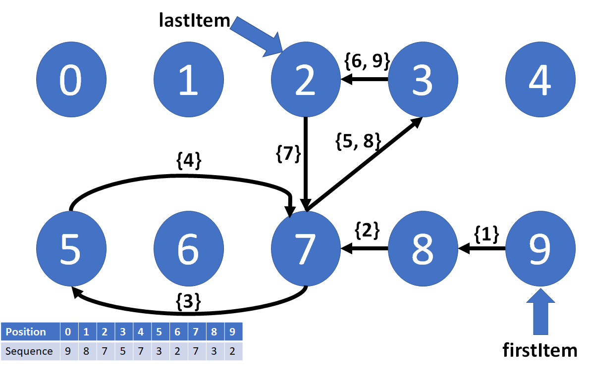
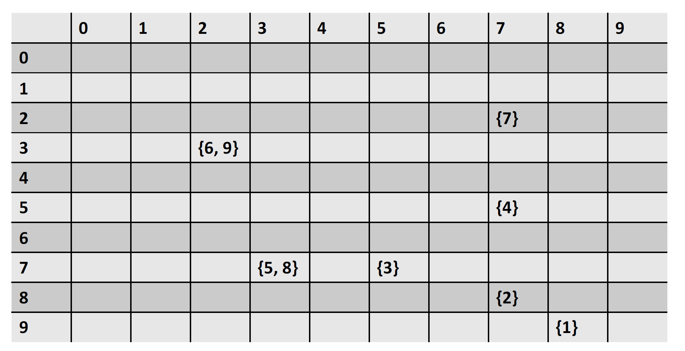
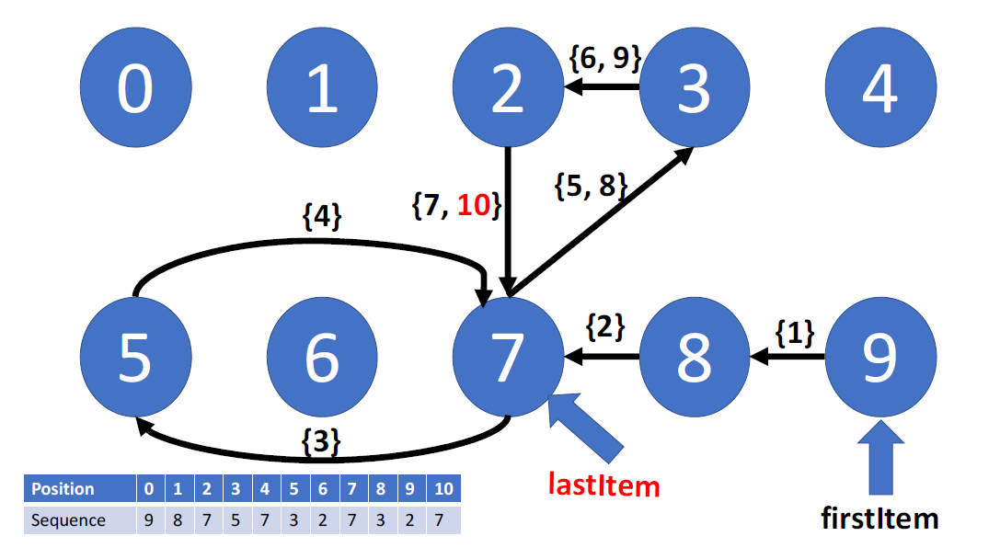
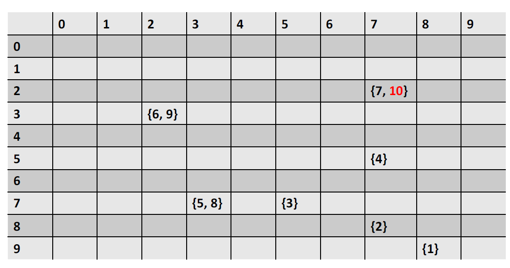
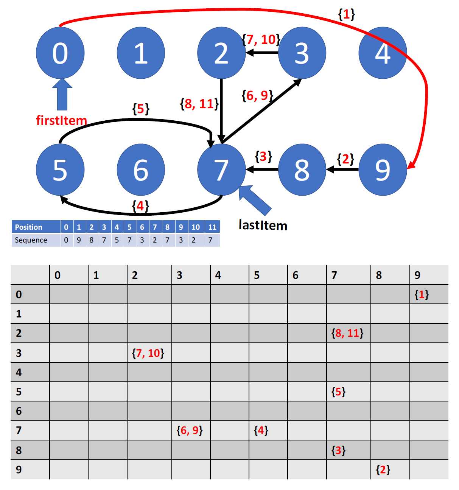

# CS 0445 – Algorithms and Data Structures 1 – Assignment#1 [^1]

**Due: Friday September 29th @ 11:59pm**

You should submit the files `ArrayDS.java` and `ReallyLongInt.java` to GradeScope (the link is on
Canvas). You must also submit an Assignment Information Sheet `InfoSheet.md` as described in the Submission
Requirements section below.

**Late submission: Sunday October 1st @11:59pm with 10% penalty per late day**

## TABLE OF CONTENTS

- [Overview](#overview)
- [Task 1: ArrayDS](#Task-1-ArrayDS)
- [Task 2: ReallyLongInt](#Task-2-ReallyLongInt)
- [Extra Credit](#Extra-Credit)
- [Submission Requirements](#submission-requirements)
- [Rubrics](#rubrics)
- [Hints/Notes](#hints--notes)

## OVERVIEW

**Purpose:** To refresh your Java programming skills, to emphasize the object-oriented programming
approach used in Java, to practice working with Java single- and two-dimensional arrays, and to use the ADT Bag. Specifically, you will work with control
structures, class-building, interfaces and generics to **create** and **utilize** a two-dimensional-array-based
data structure.

- **Task 1:** To design and implement a generic class `ArrayDS<T>` that will act as a data structure for accessing
sequences of Java Objects. Your `ArrayDS<T>` class will primarily implement 2 interfaces –
`SequenceInterface<T>` and `ReorderInterface`. The details of these interfaces are explained in the files
`SequenceInterface.java` and `ReorderInterface.java`. **Read these files over very carefully before implementing
your `ArrayDS<T>` class.**

- **Task 2:** To utilize your `ArrayDS<T>` class to store and manipulate arbitrary length **integers**. We can think of an integer as a sequence of decimal digits. For example, the number `1234` could be stored as the digit
'1' followed by the digit '2' followed by the digit '3' followed by the digit '4'. We will store these digits in
an `ArrayDS` object. Clearly, to perform operations on a number that is stored in this fashion, we must
access the digits one at a time in some systematic way. More specific details follow below.

[^1]: Assignment adapted from Dr. John Ramirez’s CS 0445 class.


## TASK 1: ArrayDS

For the details on the functionality of your `ArrayDS<T>` class, carefully read over the files
`SequenceInterface.java`, `ReorderInterface.java` and `Assig1A.java`. You must use these files as specified and **cannot remove/alter any of
the code that is already written in them**. There are different ways of implementing the
`SequenceInterface<T>` and `ReorderInterface` interface methods, some of which are more efficient than
others. Try to think of the best way of implementing these methods in this assignment, but the most
important thing at this point is getting them to work correctly. A lot of pencil and paper work is
recommended before actually starting to write your code. Later we will discuss the relative merits of
different implementations. Your `ArrayDS<T>` class header should be:

`public class ArrayDS<T> implements SequenceInterface<T>, ReorderInterface {`

**Important Note: The primary data within your `ArrayDS<T>` class *must be* a two-dimensional
array. You may not use any predefined Java collection class (e.g., `ArrayList`) for your `ArrayDS<T>` data
fields. You may not declare any one-dimensional arrays except in the `toArray()`, `reverse()`, and
`hasSubsequence()` methods.**

You must use the following instance variables inside the `ArrayDS<T>` class:

```java
private final BagInterface<Integer>[][] array; //the underlying 2-D array
private int size; //the number of items in the sequence
private T[] alphabet; //the possible item values (e.g., the decimal digits)
private T firstItem; //the first item in the sequence
private T lastItem; //the last item in the sequence
```
You should add other variables and named constants to follow the secure programming practices we
mentioned in class.

To illustrate how to store a sequence of objects as a two-dimensional array, let's have an example.

Let's take the sequence `9875732732` as an example. This is a sequence of decimal digits. The sequence
alphabet is the set of possible values from which the sequence items are drawn. So, in this example the
alphabet is the set of decimal digits `{0, 1, 2, 3, 4, 5, 6, 7, 8, 9}`. This sequence can be represented using the following
diagram.



Each of the ten digits of the alphabet is represented by a circle. Every pair of consecutive digits
in the sequence results in an arrow in the diagram, and the arrow's label includes the position of the
second digit in the pair. For example, because 9 is followed by 8 in the sequence, there is an arrow from
9 to 8 in the diagram. Because the position of 8 in the sequence is 1, the arrow from 9 to 8 has 1 in its
label. Because 3 is followed by 2 twice in the sequence, the arrow from 3 to 2 is labeled by 6 and 9, the
positions of 2 in the sequence in both occurrences of `32` in the sequence.

To construct the sequence from the diagram, we follow the arrows starting from the `firstItem` (9), then 8 then 7. With each step, we keep track of our position in the squence. At 7, we are at position 2 and we have to decide whether to go to 3 or to 5. We go
to 5 because of the label {3} of the arrow from 7 to 5, indicating that 5 is at the next position (3). We keep following the arrows until we reach
the last item. The circles that we will go through represent the sequence.

Here are some properties of the sequence in the example above. Please match these with the methods
in `SequenceInterface.java`.

```java
size() == 10
first() == 9
last() == 2
predecessor(8, 7) == true
predecessor(9, 2) == false
getFrequencyOf(3) == 2
itemAt(3) == 5
firstOccurenceOf(7) == 2
indexInAlphabet(3) == 3
nextIndex(7, 2) == 5
nextIndex(7, 7) == 3
prevIndex(2, 6) == 3
prevIndex(2, 9) == 3
hasSubsequence(732) == true
hasSubsequence( 983 ) == false
```

The diagram above (which by the way is called a **graph** ) is represented as an `NxN` two-dimensional array,
where `N` is the size of the alphabet, which is 10 in the example. The array representation of the diagram
above is:



Each cell at row `i` and column `j` in the array contains the label of the arrow going from item `i` in the alphabet to item `j` in the alphabet. If there is no arrow between `i` and `j`, the cell is empty (null). Each cell is a `BagInterface` of Integers.

The sequence after `append(7)` will look like:



Its array representation is:



After `prefix(0)`:



Besides the methods of `SequenceInterface<T>` and `ReorderInterface`, you will also need to write the following constructors:

```java
public ArrayDS(T[] alphabet)
public ArrayDS(ArrayDS<T> other)
```

The first constructor initializes the underlying array to a 2-d array of size
`alphabet.length`x`alphabet.length`. The entry type is `ResizableArrayBag<Integer>`. The `BagInterface` and the `ResizableArrayBag` classes are already provided for you. The second constructor (copy constructor) initializes the `ArrayDS` object as a copy of the argument (inserting all of the items inside the arrays in the argument object to the corresponding arrays in the new object).

Finally, you will need to override the following method:

`public String toString();`

This method will return a `String` that is the concatenation of all of the items in the Sequence implemented by the `ArrayDS` object appended
together without spaces. For example, if an `ArrayDS` object contains the numbers `1, 2, 3, 4, 5, 6`,
toString() should output: 123456


After you have finished your coding of `ArrayDS<T>`, the `Assig1A.java` file provided for you should compile and run correctly and should give output identical to the output shown in the file `A1Out.txt`. Please note that this statement doesn't suggest that you delay testing until you are done with all the methods of `ArrayDS`. Instead, you should use stubs and incrementally test your code using `Assig1A.java` as you code up each of the methods.


## Task 2: ReallyLongInt

The second part of this assignment is to write the `ReallyLongInt` class with the specification given below. `ReallyLongInt` implements a non-negative integer with an arbitrary size that has no leading zeros. Arbitrary long integers are useful in many application, such as in cryptography.

**Inheritance:** ReallyLongInt must be a subclass of `ArrayDS`. However, since `ArrayDS` is generic while
ReallyLongInt is not generic, you should use the following header:

`public class ReallyLongInt extends ArrayDS<Integer> implements Comparable<ReallyLongInt> {`

Note that rather than `T`, the underlying element data type in `ArrayDS` is now `Integer`. This means that the individual
digits of your `ReallyLongInt` will be Integer objects.

**Data:** The data for this class is inherited and **you may not add any additional instance variables**. You
will certainly need local (method) variables for the various operations but the only instance variables that you
need are those inherited from `ArrayDS`. Note that you cannot access the `ArrayDS` instance variables
directly from inside `ReallyLongInt` code. You may only use the public methods of `ArrayDS`.

**Operations:** Your `ReallyLongInt` class must implement the methods shown below. Note that the
`compareTo()` method is necessary to implement the `Comparable` interface.

`private ReallyLongInt(int size)`

This constructor will create a "zeroed out" `ReallyLongInt` with the given size. Note that this constructor leaves the number in an inconsistent state (having leading zeros), so it should only be used
within the class itself as a utility (for example, you will probably need it in your `add()` and
`subtract()` methods). For this reason, it is declared as private.

`public ReallyLongInt(String s)`

The string `s` consists of a valid sequence of digits with no leading zeros (except for the number 0
itself – a special case). Insert the digits as Integer objects, such that the most significant digit is at the beginning (head) of the sequence.

`public ReallyLongInt(ReallyLongInt other)`

This just requires a call to `super`. However, it is dependent upon a correct implementation of
the copy constructor for the `ArrayDS` class.


**To help you out with the assignment, I have implemented the methods above for you, with
comments. See the code in ReallyLongInt.java.**

`public ReallyLongInt add(ReallyLongInt rightOp)`

Return a NEW `ReallyLongInt` that is the sum of the current `ReallyLongInt` and the parameter
`ReallyLongInt`, without altering the original values. For example:
```java
ReallyLongInt X = new ReallyLongInt("123456789");
ReallyLongInt Y = new ReallyLongInt("987654321");
ReallyLongInt Z;
Z = X.add(Y);
System.out.println(X + " + " + Y + " = " + Z);
```

should produce the output:
123456789 + 987654321 = 1111111110

Be careful to handle the addition carry correctly and to process the digits in the correct
order. Also, be careful to handle numbers with differing numbers of digits.

`public ReallyLongInt subtract(ReallyLongInt rightOp)`


Return a NEW `ReallyLongInt` that is the difference of the current `ReallyLongInt` and the
parameter `rightOp`. Since `ReallyLongInt` is specified to be non-negative, if `rightOp` is
greater than the current `ReallyLongInt`, you should throw an `ArithmeticException`. Otherwise,
subtract digit by digit (borrowing if necessary) as expected. This method is tricky because it can
result in leading zeros, which we don't want. Be careful to handle this case (and consider the
methods provided by `ArrayDS` that will allow you to handle it). For example:

```java
ReallyLongInt X = new ReallyLongInt("123456");
ReallyLongInt Y = new ReallyLongInt("123455");
ReallyLongInt Z;
Z = X.subtract(Y);
System.out.println(X + " - " + Y + " = " + Z);
```

should produce the output:
`123456 - 123455 = 1`

As with the `add()` method, be careful to handle numbers with differing numbers of digits. Also
note that borrowing may extend over several digits. See `RLITest.java` for some example cases.

**Important Note:**

Both the `add()` and `subtract()` methods are tricky and have different cases to consider. For these
methods especially I recommend working out some examples on paper to see what needs to be
considered before actually coding them.

`public int compareTo (ReallyLongInt rightOp)`

Defined the way we expect `compareTo` to be. Remember that if one number has more
digits than the other, then clearly it is bigger (since there are no leading 0s). Otherwise, the
numbers must be compared digit by digit.

`public boolean equals(Object rightOp)`

Defined the way we expect `equals` to be defined for objects – comparing the data and not the
reference. Don't forget to cast `rightOp` to `ReallyLongInt` so that its array can be accessed (note: the argument is an `Object` rather than `ReallyLongInt` because we are overriding `equals()` from
the version defined in class `Object`). Note: This method can easily be implemented once
`compareTo()` has been completed.


`public ReallyLongInt multTenToThe(int num)`

Return the result of multiplying the current `ReallyLongInt` by 10^num. Note that this can be done
very simply through adding of 0's.

`public ReallyLongInt divTenToThe(int num)`

Return the result of Dividing the current `ReallyLongInt` by 10^num. Note that this can be done very
simply through shifting.

To verify that your ReallyLongInt class works correctly, you will use it with the program `RLITest.java`. Your output should match that shown
in `RLITest.txt`. Please note that this statement doesn't suggest that you delay testing until you are done with all the methods of `ReallyLongInt`. Instead, you should use stubs and incrementally test your code using `RLITest.java` as you code up each of the methods.

## Coding Style and Documentation

Please check [this guide](https://introcs.cs.princeton.edu/java/11style/) for directions regarding the expected coding style and documentation.


## EXTRA CREDIT

Here are a couple non-trivial extra credit ideas. Either one done well could get you the full 15 extra
credit points. However, don't attempt either until you are confident that your required classes are
working correctly.

− Allow the numbers to be signed, so that we can have both positive and negative numbers. This
may require an extra instance variable (for the "sign") and will clearly affect many of your
methods. If you choose this extra credit, you must submit it as a separate class (`ReallyLongInt2`)
in addition to your original `ReallyLongInt` class. You must also submit a separate driver program
to test/demonstrate your `ReallyLongInt2` class.

− Add a `multiply()` method to your `ReallyLongInt` class. If you implement this you should also
submit a separate driver program to test/demonstrate the `multiply()` method.

## SUBMISSION REQUIREMENTS

The only two source files that you can change are:

1. `ArrayDS.java`
2. `ReallyLongInt.java`

You must submit the above two files together with an edited version of `InfoSheet.md`.

The idea from your submission is that the autograder can compile and run both of the main programs
(`Assig1A.java` and `RLITest.java`) **from the command line** WITHOUT ANY additional files or changes, so be
sure to test them thoroughly before submitting it.

**Note: If you use an IDE such as NetBeans, Eclipse, or IntelliJ, to develop your programs, make sure
they will compile and run on the command line before submitting – this may require some
modifications to your program (such as removing some package information).**


## RUBRICS

Please note that if an autograder is available, its score will be used as a guidance for the TA, not as an official final score. Please also note that the autograder rubrics are the definitive rubrics for the assignment. The rubrics below will be used by the TA to assign partial credit in case your code scored less than 40% of the autograder score. If your code is manually graded for partial credit, the maximum you can get for the autograded part is 60%.

| Item | Grade |
|------|-------|
|ArrayDS |  |
|Constructors| 2|
|toString() method | 4 |
|append() and prefix() | 6 |
|removeHead() and removeTail() | 6
| clear() | 2 |
| size(), isEmpty(), first(), last() | 2 |
| reverse() | 4 |
|shiftLeft() | 2 |
| shiftRight() | 2 |
| hasSubsequence() | 5 |
|Output of Assig1A.java matches A1Out.txt | 4 |
| predecessor() | 4 |
|getFrequencyOf() | 4 |
|itemAt(), indexInAlphabet() | 4 |
| nextIndex(), prevIndex() | 6 |
|firstOccurrenceOf(), toArray() | 6 |
|-----||
| ReallyLongInt | |
|add  | 6 |
| subtract | 6 |
| compareTo | 4 |
| equals  | 2 |
| mult10ToThe  | 4 |
|div10ToThe  | 4 |
| Output of RLITest.java matches RLITest.txt | 4 |
|-----| |
|Assignment Information Sheet and correct submission | 2 |
| javadoc comments and coding style  | 5 |
| Extra credit  | 6 |

## HINTS / NOTES

1. See file `A1Out.txt` to see how your output for `Assig1A` should look. As noted, your output when
    running `Assig1A.java` should be identical to this.
2. See file `RLITest.txt` to see how your output for `RLITest.java` should look. As noted, your output when running `RLITest.java` should be identical to this.
3. In order for the `Assig1A.java` output to show correctly, you must override the `toString()` method in
    the `ArrayDS` class. You should be familiar with the `toString()` method from CS 0401.
4. For Javadoc comments and code style, please refer to Appendix A of the textbook.
5. Think carefully about the order of implementing the methods of `ArrayDS` as some methods can make other methods easier to implement
